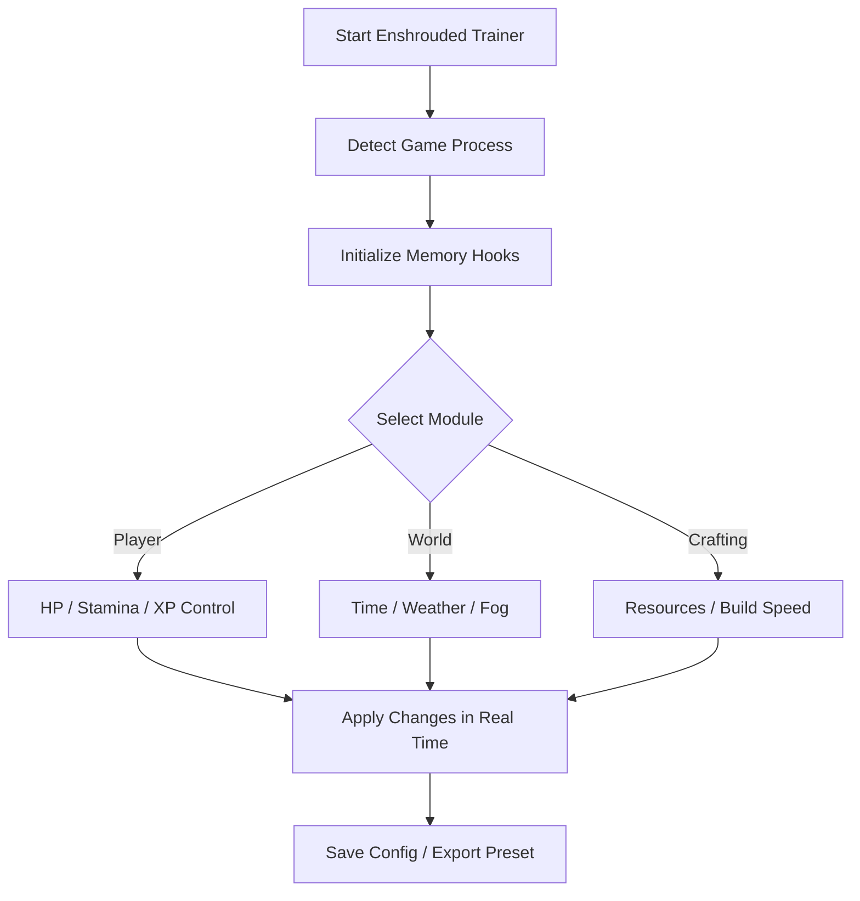

# Enshrouded Trainer 🔥

Survive the Shroud, not by chance — but by design. The **Enshrouded Trainer** gives players complete authority over survival parameters, combat balance, and crafting systems. Built for both testing and total immersion, it lets you explore freely, experiment with builds, and conquer the fog that once claimed your world.

---

## 🌫 Overview

In *Enshrouded*, every step through the haze can mean triumph or tragedy. The **Trainer** removes unnecessary barriers — fatigue, hunger, material scarcity — so you can focus on what matters: discovery, combat precision, and creative mastery. It’s a full-featured modification tool designed for those who seek command rather than chaos.

---

## ⚙️ Key Features

* **Infinite Health & Stamina:** Outlast every storm and skirmish without rest.
* **Unlimited Materials:** Craft endlessly — wood, ore, cloth, or essence.
* **XP & Skill Multiplier:** Boost growth speed or max your abilities instantly.
* **Instant Build & Repair:** No cooldowns or resource costs during construction.
* **Weight & Carry Limit Removal:** Travel light, even when fully stocked.
* **Weather & Time Control:** Pause the fog, extend daylight, or fast-forward nights.
* **Invulnerability & One-Hit Mode:** Test bosses and dungeons without penalty.

[!NOTE]

> All features operate in **offline and sandbox sessions**. Online use may trigger sync resets or version checks.

---

## 🧩 Compatibility

| Platform         | Support | Notes                            |
| ---------------- | ------- | -------------------------------- |
| Windows 10       | ✅ Full  | DX11 / DX12 builds supported     |
| Windows 11       | ✅ Full  | Stable at 144Hz overlay          |
| Steam            | ✅       | Auto game detection              |
| Epic Games       | ⚠️      | Requires manual folder input     |
| Controller Input | ✅       | Toggle cheats via radial overlay |

---

## ⚡ Quick Setup

1. Extract the archive into your *Enshrouded* installation folder.
2. Run as Administrator:

   ```bash
   Enshrouded_Trainer.exe --boot
   ```
3. Launch the game.
4. Press **F7** to open the Trainer interface.
5. Activate desired features or load saved profiles (`survivor.ini`, `builder.ini`, `creative.ini`).

[!IMPORTANT]

> Launch the trainer before the game to ensure all memory hooks initialize safely.

---

## 🌫 Trainer System Flow



---

## 🧰 Example Configurations

```ini
[survivor_mode]
stamina=infinite
health=infinite
xp_multiplier=2.0
weight_limit=none
fog_density=0.5
time_freeze=false

[creative_mode]
materials=unlimited
build_cooldown=off
weather=clear
light_intensity=2.0
```

Switch instantly via **F8**, or load manually using:

```bash
enshrouded --load creative_mode.ini
```

[!WARNING]

> Setting time speed beyond `4x` may cause lighting desync or physics delay in large areas.

---

## ❓ FAQ

**Q: Does the trainer edit save files?**
A: No. It modifies temporary runtime values only. Your data stays clean.

**Q: Can it be used online?**
A: No. The trainer is optimized for solo, offline, or modded worlds only.

**Q: Will it affect achievements?**
A: Achievements are automatically paused during active sessions to prevent conflicts.

**Q: Can I customize hotkeys?**
A: Yes — open `/config/hotkeys.json` and map your preferred controls.

**Q: How does it handle patches?**
A: It auto-detects game versions and realigns offsets after updates.

---

## 🔧 Advanced Tools

* **Free Camera Mode:** Detach camera for cinematic captures.
* **Environmental Editor:** Modify fog color, density, and particle intensity.
* **AI Freeze Toggle:** Pause enemies and wildlife for exploration or photo use.
* **Weather Sync Control:** Maintain constant dawn, dusk, or twilight ambience.

[!NOTE]

> Combine *Free Camera* + *Fog Editor* for professional-level screenshots or content creation.

---

## 🌄 Final Thoughts

The **Enshrouded Trainer** was made for players who want to experience freedom without friction — to explore without grind, to build without limits, and to uncover the hidden beauty of the world beneath the mist.

Craft. Conquer. Create. The fog bows to you now.

---

*The mist no longer hides — it obeys. The Enshrouded Trainer turns survival into art, and the world into your masterpiece.*
